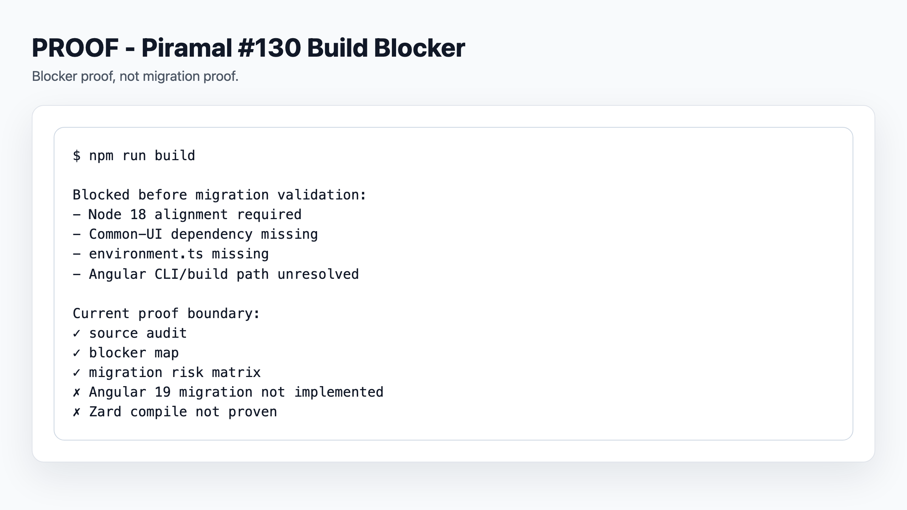
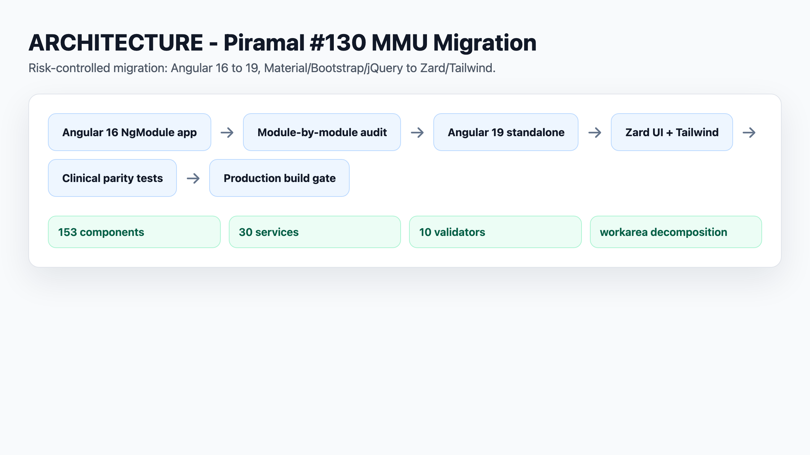
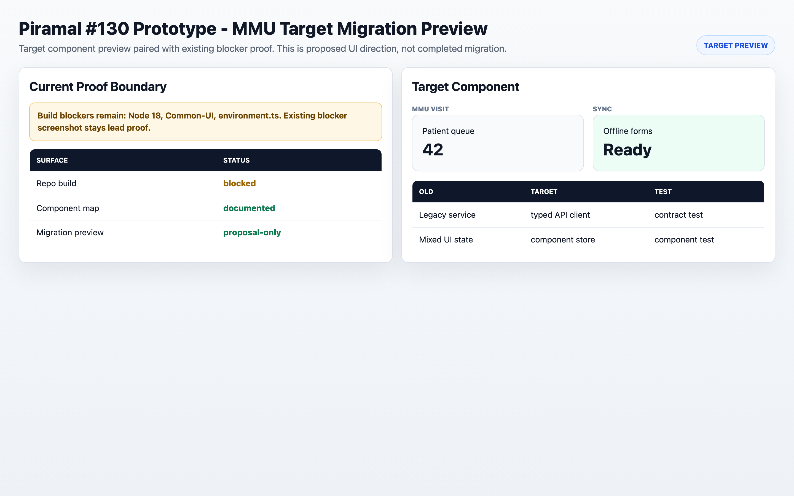

# Piramal #130 Proof Packet

This packet supports the C4GT proposal for Piramal #130: MMU-UI Angular 16 to Angular 19 migration with Zard UI and Tailwind CSS.

It is evidence for proposal readiness. It is not evidence that the migration has already been implemented.

## Artifact Map

| Claim | Artifact | What It Shows | Caveat |
|---|---|---|---|
| I audited the live MMU-UI repo. | `piramal-130-system-map.md` | Framework baseline, route shape, source counts, largest files, module risk areas. | Counts are from one live clone and should be rechecked before coding starts. |
| I attempted local setup. | `piramal-130-proof-plan.md` | `npm install` completed; default and dev builds were attempted; blockers were captured. | Build does not pass yet. Node 18 and `Common-UI` setup need alignment. |
| I understand the UI migration surface. | `piramal-130-material-zard-map.md` | Material component families, Zard replacement direction, Bootstrap/Tailwind strategy, AI migration controls. | Zard UI has not yet been compiled inside MMU-UI. |
| I understand migration risk. | `piramal-130-migration-risk-matrix.md` | Risks around environment, Angular versions, forms, tables, dialogs, dates, Bootstrap, large files, tests, and accessibility. | Risk ratings should be updated after real Angular 19 build work starts. |
| I can show a first migration slice. | `piramal-130-mifi-prototype.html` | A source-tied mi-fi prototype for login, service-point, and worklist/table patterns. | This is a static prototype, not app code. |
| I know the prototype limits. | `piramal-130-zard-prototype-notes.md` | What the prototype proves and what it does not prove. | It does not replace runtime verification. |

## Files

- `piramal-130-system-map.md`
- `piramal-130-material-zard-map.md`
- `piramal-130-migration-risk-matrix.md`
- `piramal-130-proof-plan.md`
- `piramal-130-selected-proposal-patterns.md`
- `piramal-130-zard-prototype-notes.md`
- `piramal-130-mifi-prototype.html`

## How To Inspect

1. Read `piramal-130-system-map.md` first.
2. Read `piramal-130-material-zard-map.md` for the UI replacement strategy.
3. Read `piramal-130-migration-risk-matrix.md` to understand the migration controls.
4. Open `piramal-130-mifi-prototype.html` in a browser to view the static proof slice.
5. Read `piramal-130-proof-plan.md` for setup/build status and caveats.

## Screenshot Plan

Captured screenshots now in `screenshots/`:

- `screenshots/piramal-130-mifi-prototype.html.png`
- `screenshots/README.md.png`
- `screenshots/piramal-130-proof-plan.md.png`

Optional additional captures:

- login/service-point close crop,
- worklist/table close crop.

These screenshots should be labeled as proposal evidence, not implementation evidence.

## What This Proves

- The proposal is grounded in the live MMU-UI source, not only the issue title.
- The applicant inspected module shape, source size, UI dependencies, and high-risk clinical surfaces.
- The applicant attempted setup and recorded blockers instead of hiding them.
- The UI migration plan separates low-risk primitives from high-risk clinical workflows.
- The proposal has a reviewer-checkable proof artifact.

## What This Does Not Prove

- Angular 19 migration is complete.
- Standalone conversion is complete.
- Zard UI compiles inside MMU-UI.
- Bootstrap/jQuery removal is complete.
- Production build passes.
- Clinical workflows have been runtime-verified.

## Next Proof Upgrade

The next proof step should be:

1. Run the project under Node 18.
2. Resolve `Common-UI` setup.
3. Provide a valid `src/environments/environment.ts`.
4. Rerun build.
5. If build works, port one low-risk source slice or create a public wrapper-pattern proof.

<!-- C4GT_VISUAL_SCREENSHOTS_START -->
## Visual Proof Screenshots

Generated reviewer-facing PNGs. Runtime/prototype screenshots lead each project; architecture and proof tables remain supporting evidence. Prototype images do not expand the verified implementation boundary.

### Build blocker proof; not migration proof.

Path: `screenshots/build-blocker-proof.png`

### Migration architecture and build gates.

Path: `screenshots/mmu-migration-architecture.png`

### Prototype target preview: proposed migrated MMU component direction.

Path: `screenshots/prototype-mmu-target-preview.png`
<!-- C4GT_VISUAL_SCREENSHOTS_END -->
